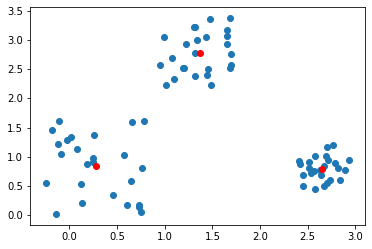

Task 1

Easy problem

Hard problem

Task 2

Step 1

    
Step 2

Step 3

Step 4

Result

Task 3

Mine k-means is faster than scipy: 0ns vs 18ms (it looks strange, may be with hard problem or with a lot of points my k-means will be not so fast)

Scipy k-means result

